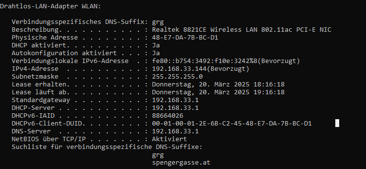
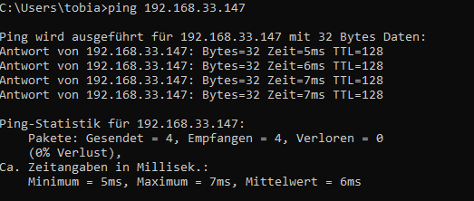
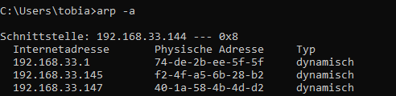

## DHCP Server 
IP: 192.168.33.144

SM: 255.255.255.0

Gateway: 192.168.33.1

Lease Dauer: 1 Stunde

DNS-Server: 192.168.33.1

DNS-Suffixe: grg spengergasse.at

MAC-Adresse herausfinden mit ARP:

